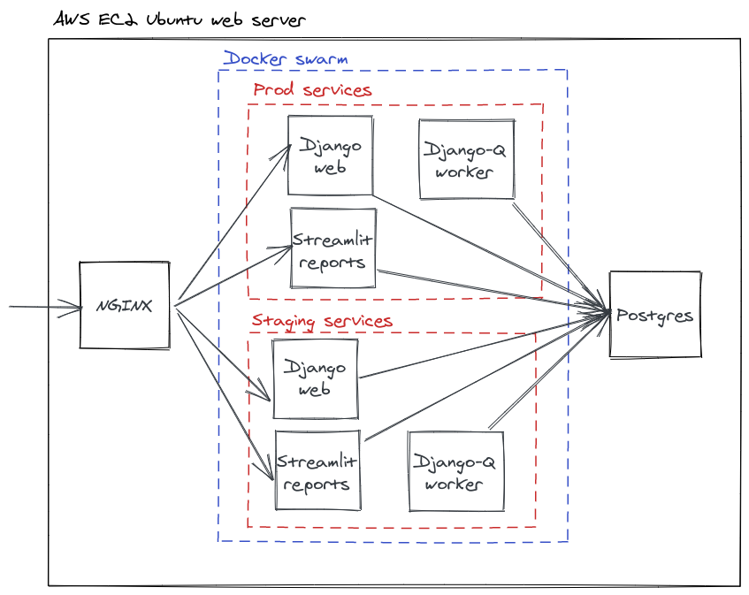

# Clerk


This site is used by new Anika clients who want to submit their legal problem. Clients may submit the facts of their case using a structured form interface. Their case file is then entered into our case managment system.

> Depending on the job, office clerks might answer phones, filing, data processing, faxing, envelope stuffing and mailing, message delivery, running errands, sorting incoming mail and much more. ([source](https://www.snagajob.com/job-descriptions/office-clerk/))

## Structure

This Django project has several apps:

- accounts: User accounts
- actionstep: Actionstep integration
- admin: Customization of Admin interface
- caller: Call centre
- case: Case management system website
- clerk: Project settings
- core: Core domain models and functionality
- slack: Slack integration
- web: Public website and blog
- webhooks: Webhooks from 3rd party services

## Prerequisites for Local Development

You will need:

- `docker` ([install](https://docs.docker.com/install/#supported-platforms))
- `docker-compose` ([install](https://docs.docker.com/compose/install/))

## Getting Started

First, add a file called `.env` to the repository root with the following contents:

```text
SENDGRID_API_KEY=
MAILCHIMP_API_KEY=
AWS_ACCESS_KEY_ID=
AWS_SECRET_ACCESS_KEY=
ACTIONSTEP_CLIENT_ID=
ACTIONSTEP_CLIENT_SECRET=
TWILIO_ACCOUNT_SID=
TWILIO_AUTH_TOKEN=
GOOGLE_OAUTH2_KEY=
GOOGLE_OAUTH2_SECRET=
```

The values of these secrets will be provided to you if you need them.

Next, you want to build the Docker environment that we'll be using:

```bash
make build
```

Now you can set up your database with this reset script:

```bash
./scripts/db/reset.sh
```

To do this manually, you can to get a bash shell into the web container and run a Django database migration:

```bash
# Get a bash shell in the container
make bash

# Setup the development database for Django - you only need to do this once.
./manage.py migrate

# Create a local admin user
./manage.py createsuperuser
```

Finallly you can exit the container shell and bring up the webserver:

```bash
make web
```

Now you should be able to visit [`http://localhost:8000/admin`](http://localhost:8000/admin) and see the Clerk site.

You can also get a Django shell using:

```bash
make shell
```

## Deployment

Deployment is done via a GitHub workflow [here](https://github.com/AnikaLegal/clerk/actions?query=workflow%3ADeploy.) A deployment involves SSHing into the target server and updating the Docker Swarm config. Deployment must be manually triggered from GitHub. There are two environments to deploy to, test and prod:

- [test backend](https://test-clerk.anikalegal.com/admin), which is deployed to by `develop`, used by the [test frontend](https://test-repairs.anikalegal.com)
- [prod backend](https://clerk.anikalegal.com/admin), which is deployed to by `master`, used by the [prod frontend](https://repairs.anikalegal.com)

When making a change or bugfix, you should:

- create a feature branch from `develop` called `feature/my-branch-name` and test it locally
- merge the branch into `develop` and trigger a release to the test environment
- check your changes in the test environment
- merge the `develop` into `master` trigger a release of your change to prod

## Infrastructure



There are two containers that run the application. A Django web server and a [Django Q](https://django-q.readthedocs.io/en/latest/) worker server. Both connect to a common database.

The application runs on Docker Swarm. The test and prod environments both run on a single AWS EC2 instance. That instance also contains the PostgreSQL database and a NGINX server which reverse proxies requests into the Docker containers.

Database backups are taken manually and stored in `s3://anika-database-backups`. Uploaded files are stored in `s3://anika-clerk` and `s3://anika-clerk-test`. Other than uploaded files and the contents of the PostgreSQL database, there is no important state on the EC2 instance or Docker images, which can be blown away and rebuilt at will. The only thing that will change is that EC2 instance IP address, which will need to be updated in CloudFlare.

DNS is handled by [CloudFlare](https://dash.cloudflare.com/7de9e8b83e7f8e80bdb5f40ec9e0ef22/anikalegal.com/dns), which also does SSL termination for us.

Emails are sent using [SendGrid](https://app.sendgrid.com).

Infra config can be found in the [infra](https://github.com/AnikaLegal/infra) repo.

## Logging and Error Reporting

- All application logs are logged to [Papertrail](https://papertrailapp.com/systems/Clerk/events).
- Errors are reported to [Sentry](https://sentry.io/organizations/anika-legal/projects/).
- Application uptime is tracked by [StatusCake](https://app.statuscake.com/YourStatus.php).

## Testing and Linting

This app has unit tests. They are not run in CI, but if you are making changes, please run them:

```
make test
```

To run specific tests

```
docker-compose -f docker/docker-compose.local.yml run --rm test bash
pytest case/tests/test_urls.py -vv
```

The Python code is formatted with Black. To check the code with the linter run:

```
make lint
```

To automatically fix any linting errors, run:

```
make format
```

## Docker

The environment for this app is built using Docker, and the app runs in production using Docker Swarm. Our The `docker` directory has the following files:

- Dockerfile.base: base Docker image, used to build [anikalaw/clerkbase](https://hub.docker.com/repository/docker/anikalaw/clerkbase)
- Dockerfile: final Docker image, used to build [anikalaw/clerk](https://hub.docker.com/repository/docker/anikalaw/clerk)
- docker.compose.local.yml: Docker Compose config for local development
- docker.compose.staging.yml: Docker Swarm config for test environment
- docker.compose.prod.yml: Docker Swarm config for prod environment

## Twilio

We are using Twilio to handle inbound phone calls. To test Twilio locally:

- Ensure you have access to the Anika Twilio account
- Ensure you have set the correct Twilio envars in your .env file (see "Getting Started" section)
- Start the Django server
- Install and run [ngrok](https://ngrok.com/) for port 8000: `ngrok http 8000`
- Login to Twilio and [configure the test phone webhook](https://www.twilio.com/console/phone-numbers/PN5ab5df1280aa1456035801dd1a25824a) so that it points to your ngrok endpoint, eg. `http://88b59b03d2fd.ngrok.io/caller/answer/`
- Ring the test number on +61480015687
- When finished, change the webhook back to staging: `https://test-clerk.anikalegal.com/caller/answer/`
