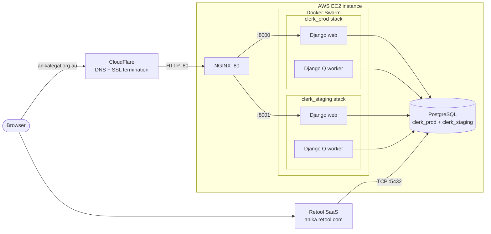

# Infrastructure

Clerk runs on a single AWS EC2 instance in the Sydney region, with file storage and backups in S3 and CloudFlare in front for DNS and SSL. Both the staging and production environments live on that one instance as Docker Swarm stacks. This page describes the architecture and how to build, deploy, rebuild and monitor it.

## Architecture

The EC2 instance runs Docker Swarm with one stack per environment. Each stack has two services: a Django web server and a [Django Q](https://django-q2.readthedocs.io/en/master/) worker for background tasks. The worker uses the database as its task broker, so there is no separate queue or cache service.

The instance also hosts two services outside of Docker:

- PostgreSQL, with one database per environment. The containers connect to it over a unix socket; [Retool](https://retool.com) connects directly over TCP for internal reporting (see `infra/setup/postgres/pg_hba.conf`).
- NGINX, which reverse proxies each environment's domain to its web service.

[CloudFlare](https://dash.cloudflare.com/7de9e8b83e7f8e80bdb5f40ec9e0ef22/anikalegal.org.au/dns/records) provides DNS and terminates SSL, so the instance itself only serves plain HTTP on port 80.

The public intake form (a Vite/SurveyJS SPA in `intake/`) is built into the application image and served by the Django `web` service at `/intake/` via the thin `app/intake` app, so it sits behind NGINX and CloudFlare like the rest of the site.

## Environments

| Environment | Domain | Deployed from | Swarm stack | Web port | Database |
| ----------- | ------ | ------------- | ----------- | -------- | -------- |
| Staging | [staging.anikalegal.org.au](https://staging.anikalegal.org.au/admin) | `develop` | `clerk_staging` | 8001 | `clerk_staging` |
| Production | [anikalegal.org.au](https://anikalegal.org.au/admin) | `master` | `clerk_prod` | 8000 | `clerk_prod` |

Each environment serves its own intake form at `/intake/` (e.g. [anikalegal.org.au/intake/](https://anikalegal.org.au/intake/)).

Each environment's configuration and secrets live in a transcrypt-encrypted env file (`env/staging.env`, `env/prod.env`), which the compose files pass to the containers. See [setup.md](./setup.md) for how to unlock transcrypt.

## Data and state

The only state that matters lives in PostgreSQL and S3:

- the two PostgreSQL databases, which run on the instance's own disk (not in S3)
- uploaded files in `s3://anika-clerk` and `s3://anika-clerk-staging`
- images referenced by sent emails (e.g. logos) in `s3://anika-emails` and `s3://anika-emails-staging`
- call centre audio in `s3://anika-twilio-audio` and `s3://anika-twilio-audio-staging`
- database backups in `s3://anika-database-backups` and `s3://anika-database-backups-staging`

The S3 buckets are durable independently of the instance. The PostgreSQL databases are **not**: they live on the instance's disk, so if the instance is lost, so is any database data written since the last backup. What keeps that loss bounded is the nightly dump: the production database is dumped to S3 every night via GitHub Actions (staging is not backed up directly - it is regenerated from production), and AWS Backup additionally snapshots the S3 buckets - see [backups.md](./backups.md) for the full story.

So rebuilding the server means restoring the databases from those S3 backups (step 3 of [Server setup](#server-setup)), which recovers database state only as far as the most recent nightly dump. With that caveat, everything else - the EC2 instance, the Docker images and containers - holds no state that cannot be restored, and can be blown away and rebuilt (see [Server setup](#server-setup)).

## Images and builds

Application code is packaged into Docker images, defined in the `docker` directory:

- `Dockerfile.base`: the base image [anikalaw/clerkbase](https://hub.docker.com/r/anikalaw/clerkbase), built and pushed manually with `infra/build_base_image.sh` when it changes
- `Dockerfile`: the application image [anikalaw/clerk](https://hub.docker.com/r/anikalaw/clerk), built and pushed by the [Test workflow](../.github/workflows/test.yml) after tests pass - merges to `develop` produce the `staging` tag, merges to `master` produce the `prod` tag
- `Dockerfile.frontend`: builds the frontend (the Clerk CMS SPA), whose output is copied into the application image
- `Dockerfile.intake`: builds the public intake form SPA (`intake/`), whose output is copied into the application image and served at `/intake/`

Compose files in the same directory define how the images run: `docker-compose.local.yml` (local development), `docker-compose.ci.yml` (tests in CI), and `docker-compose.staging.yml` / `docker-compose.prod.yml` (the Swarm stacks).

## Deployment

Deployment is done via the [Deploy workflow](https://github.com/AnikaLegal/clerk/actions?query=workflow%3ADeploy), which must be triggered manually from GitHub. It connects to the server's Docker daemon over SSH and updates the environment's Swarm stack to the latest image. It does not build anything: images come from the Test workflow (see above).

When making a change or bugfix, you should:

- create a branch from `develop` called e.g. `feature/my-branch-name` and test it locally
- merge the branch into `develop` and trigger a release to the staging environment
- check your changes in the staging environment
- merge the `develop` branch into `master` and trigger a release to the production environment

## Server setup

The server is provisioned and environments are initialised with the scripts under [infra/setup](../infra/setup):

1. `provision.sh <HOST>` makes a fresh Ubuntu 24.04 machine a Clerk server: NGINX, PostgreSQL, Docker Swarm, the AWS CLI and SSH hardening.
2. `init-env.sh <HOST> <staging|prod>` initialises an environment on a provisioned host: it creates the Postgres user and database and deploys the Swarm stack.
3. `restore-databases.sh <HOST>` restores the staging and production databases from the latest S3 backups. It refuses to target the current server.

To rebuild the server from scratch: launch a new Ubuntu instance, run the three scripts against it, then update the new IP address in CloudFlare and in `CLERK_HOST` in the env files.

The scripts pin the versions of software that matter for reproducing the server: PostgreSQL, Docker Engine and the AWS CLI. Each pin is a variable at the top of the relevant script, plus an `ARG` in `Dockerfile.base` for the PostgreSQL client tools, whose major version must match the database server or backups taken with one may not restore with the other. When bumping a pin, upgrade the live server to match.

## External services

| Service | Role | More info |
| ------- | ---- | --------- |
| [CloudFlare](https://dash.cloudflare.com/7de9e8b83e7f8e80bdb5f40ec9e0ef22/anikalegal.org.au/dns/records) | DNS and SSL termination | |
| [SendGrid](https://app.sendgrid.com) | Outbound and inbound email | [emails.md](./emails.md) |
| [Twilio](https://www.twilio.com) | Call centre voice prompts and SMS | [twilio.md](./twilio.md) |
| Microsoft 365 | Case documents in SharePoint, staff accounts | [sharepoint.md](./sharepoint.md), [msgraph.md](./msgraph.md) |
| [Retool](https://retool.com) | Internal reporting, with direct database access | |
| Google | Staff login (OAuth) and Workspace directory | |
| Slack | Notifications and alerts | |
| [MailChimp](https://mailchimp.com) | Mailing lists | |
| [Docker Hub](https://hub.docker.com/u/anikalaw) | Image registry | |

Credentials for these services live in the env files.

## Monitoring

- All application logs are logged to [Sumo Logic](https://service.au.sumologic.com/ui/).
- Errors are reported to [Sentry](https://sentry.io/organizations/anika-legal/projects/).
- Application uptime is tracked by [StatusCake](https://app.statuscake.com/).
